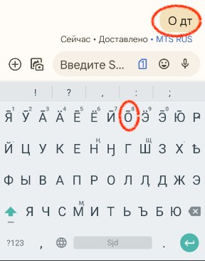
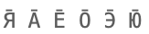

# Kildin Sámi - the lost letters

Many indigenous languages have alphabets based on Latin or Cyrillic, with additional letters or diacritics to cover all sounds in the language. If these additional letters are not also found in a majority language, chances are small that they will display correctly — or at all — on many systems.

One such case is Kildin Sámi.



In the screen shot above, the intended content of the message sent was: **О̄дт**, but it turnes out as **О дт**.

The core of the issue is that the following Kildin Sámi letters:

```
Я̄ А̄ Е̄ О̄ Э̄ Ю̄
```
(as image for non-conforming browsers: )

do not exist as single characters in Unicode. Instead, they are composed of the base letters:

```
Я А Е О Э Ю
```

\+ a **combining macron** that the system should *automatically* place above the base letters.

This is the solution chosen by the Unicode consortium: no new letters with diacritics should be added, all should be handled using this automatic diacritic placement.

But as shown above, there is no guarantee that it works. And since this system *in practice* mostly targets indigenous languages, there is also no economic or other incentive to fix or indeed discover possible issues with the system.

What do you think? Would you accept **Schloss Scho nbrunn** instead of **Schloss Schönbrunn**?
