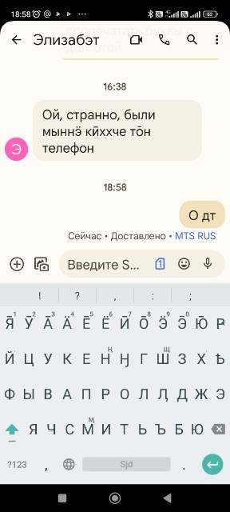

# Kildin Sámi - the lost letters

Many indigenous languages have alphabets based on Latin or Cyrillic, with additional letters or diacritics to cover all sounds in the language. If these additional letters are not also found in a majority language, chances are small that they will display correctly — or at all — on many systems.

One such case is Kildin Sámi.



In the screen shot above, the intended content of the message sent was: **О̄дт**.

The core of the problem is that the following letters:

```
я̄ а̄ е̄ о̄ э̄ ю̄
```

do not exist as single characters in Unicode. Instead, they are composed of the base letters:

```
я а е о э ю
```

+ a combining macron that the system should *automatically* place above the base letters.
